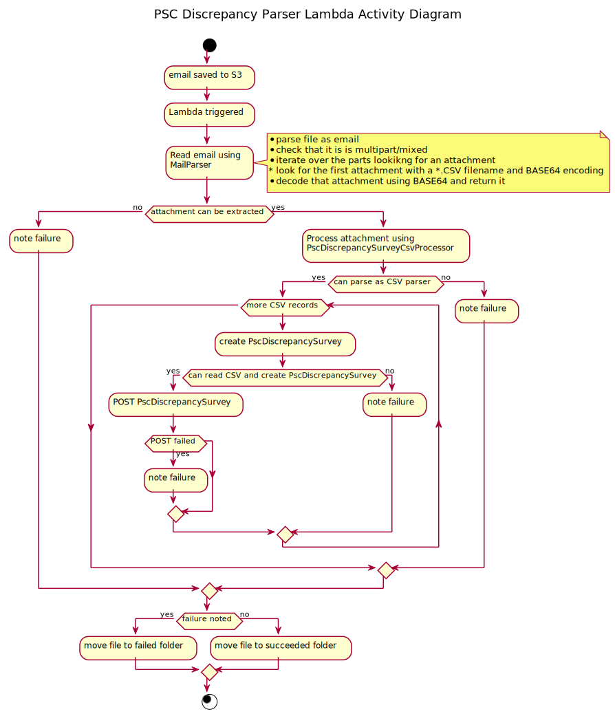

# psc-discrepancy-parser
This AWS Lambda service processes batches of CSV-format survey results (each survey gathered discrepancies with a company's Person(s) of Significant Control (PSC)), transforming a survey (in the form of a CSV record) into JSON and sending it to CHIPS.

The Lambda is associated with an S3 bucket which should contain three specific folders:
1. `source` - The batches of survey results are sent by email to an address whose emails will automatically be put into the Lambda's S3 bucket in this folder. When a files arrives in this folder, the Lambda will be triggered, being passed the details of the file so that the Lambda can process it.
2. `accepted` - If a file is successfully processed, it is moved to this folder.
3. `rejected` - If something goes wrong during processing of a file, it is moved to this folder.

The Lambda will attempt to process a new file in `source` as follows:

1. attempt to read the email and extract a CSV attachment.
2. Parse the CSV expecting a particular format, transforming each CSV record to a PscDiscrepancySurvey JSON object.
3. Send each new PscDiscrepancySurvey to CHIPS using HTTP POST.

If any of these steps fail, the file is moved to the `rejected` folder. If all succeed, the file is moved to the `accepted` folder.

## Installation
TODO

## Usage
There is not much usage to this. Using the Lambda amounts to installing it (see above) and causing a survey to be emailed to the pertinent email address. The Lambda will then be run automatically.

## Support
### The support process for dealing with a bug
Until [FAML-180 Make new PSC Discrepancy Contact creation idempotent](https://companieshouse.atlassian.net/browse/FAML-180) is fixed, hold off on re-processing any emails that have, for whatever reason, failed to be processed by the Lambda. Once that JIRA is fixed, dealing with an issue in the Lambda should proceed as follows:
1. Support should be alerted to an issue in the Lambda because an ERROR log was picked up by the AWS Cloudwatch for the Lambda's logs.
1. Get hold of those logs. In the logs, you will find:
  1. The AWS request ID.
  1. The S3 key, bucket, and object.
  1. The email's Message-ID, Subject, and Date headers.
1. Given these logs, you should be able to get hold of the file that failed and was moved to `rejected` within the Lambda's S3 bucket.
1. Give those files to the dev team supporting the Lambda.
1. When the issue has been fixed, you should be able to move the whole file back into the `source`  folder where it will be reprocessed by the Lambda. If the Lambda has already partially processed a file and successfully sent records over to CHIPS which has, in turn, created new Contacts, then this should not matter and duplicates of those new Contacts should not be created.

There are several types of issue that may arise in the Lambda:
1. Network issues/CHIPS unreachable, causing REST calls to CHIPS to fail. The solution is, once those network issues have been fixed, to move the file from the `rejected` folder back to the `source` folder and let CHIPS sort out any duplicates.
1. A bug in the Lambda code. This will be analysed by the dev team, given the file and logs and a code fix put in place. After the fixed code has been deployed, move the file from the `rejected` folder back to the `source` folder and let CHIPS sort out any duplicates.
1. An issue with the data in the email. It may be that the email should not be processed, as it does not contain an attachment. It may be that the survey has changed and that the code should change to cope with this (so this is actually the previous issue). It may be that the data has a slight issue and a small edit would fix it. In this unlikely scenario, the data could be fixed in CSV, and emailed to the live email address, where it will end up in the S3 `source` folder again.

### The dev process for supporting a bug
Within this project, in the test code area, is a class called SupportUtils. This can be edited to point to a file that may contain CSV or a whole email, which should be multipart and should contain an attachment that is a BASE64-encoded CSV. It will parse these and dump them to stdout. If you have an email that has proven troublesome in the Lambda, this tool can be used to examine that email, running our actual Lambda code against it to see where it blows up.

## Design
When this Lambda runs, it attempts to process the new file in S3 as follows:

### Design principles
#### Platform agnosticism: do not get too tied into AWS
It is possible to litter our code with AWS-specific libs. This needlessly ties us to AWS, as this is a Lambda function, and most of it has nothing to do with AWS. It should be easy to port to Azure, or similar so that we could move our code off AWS, if we needed to. With this in mind, we have tried to strike a balance.

#### Logging
All logging must use the underlying AWS platform, but by using log4j2 libs and the aws-lambda-java-log4j2 lib (along with their dependencies), we eliminate the need to use AWS logging classes anywhere: our code can just use log4j 2. We are not using the CH structured logging libs at this time, as they are not built to go on top of AWS lambda logging. Thus, our log lines are not structured JSON, though they could be at a future date, using log4j2 directly.

Logging is all currently at INFO or ERROR, with only support-worthy events being logged at ERROR.

#### S3
The S3-specific code is constrained to the Handler class. In fact, all AWS-specific code should be in here, with no other major components knowing about AWS. We have not abstracted out S3, but there is so little of it that it would not be a big job to refactor if we moved to a different platform.

The S3ObjectInputStream retrieved from the S3Object is not used directly: instead we just use the InputStream interface in our parser classes.

#### Exception handling
Any unexpected RuntimeException is allowed to escape the Lambda unlogged. This means that, in the event of such an exception, the file being parsed  would be left in the `source` folder, and not moved to the `rejected` folder. This is not as bad as it sounds, as even using an outer boundary of the form `try... catch (RuntimeException) { move to rejected }` would fail in some circumstances: bugs in our S3 code, failure to start Lambda properly... etc. Thus, there would always be a need for support to cope with a file being wedged in the `source` folder. We could still put such an outer try... catch RuntimeException block in though - there was debate within the team and we decided to take the current course on the general principle that it is bad to catch unexpected RuntimeExceptions.

#### Unit testing
With regard to the parsers, we have generally chosen to treat them as black boxes and not to mock out the underlying 3rd party libs. This is a classical, TDD approach that was questioned during dev so I am justifying the decision here, as others may ask the same question. It should not matter to the user of the MailParser that it uses JavaMail underneath, nor that the code transforming the CSV file into a POJO (later JSON) uses a particular CSV lib. We could mock out those libs, but we would end up with very brittle tests. Instead, we have gone for the approach of supplying test files containing real emails (anonymised) or CSV from the actual surveys and testing the output of the respective parsers. This is an approach to unit testing sometimes known as sociable unit testing. See: https://martinfowler.com/articles/practical-test-pyramid.html#SociableAndSolitary

## Security
* Files are stored in S3 in a private bucket.
* Logging tries not to log Personally Identifying Info (PII) at any level.
* JSON sent over to CHIPS is first processed using the OWASP JSON Sanitizer lib: https://github.com/OWASP/json-sanitizer to prevent a subset of possible CSS attacks.
* CHIPS has further mitigations in place against CSS attacks.

### Libraries used
* logging
  * AWS logging libraries
  * log4j 2
* email parsing
  * JavaMail
* CSV parsing
  * Apache Commons CSV
* JSON
  * Jackson
  * JSON Sanitizer
* HTTP Client
  * Apache HTTP Client
* Testing
  * JUnit 5
  * Mockito
  * Sonar
